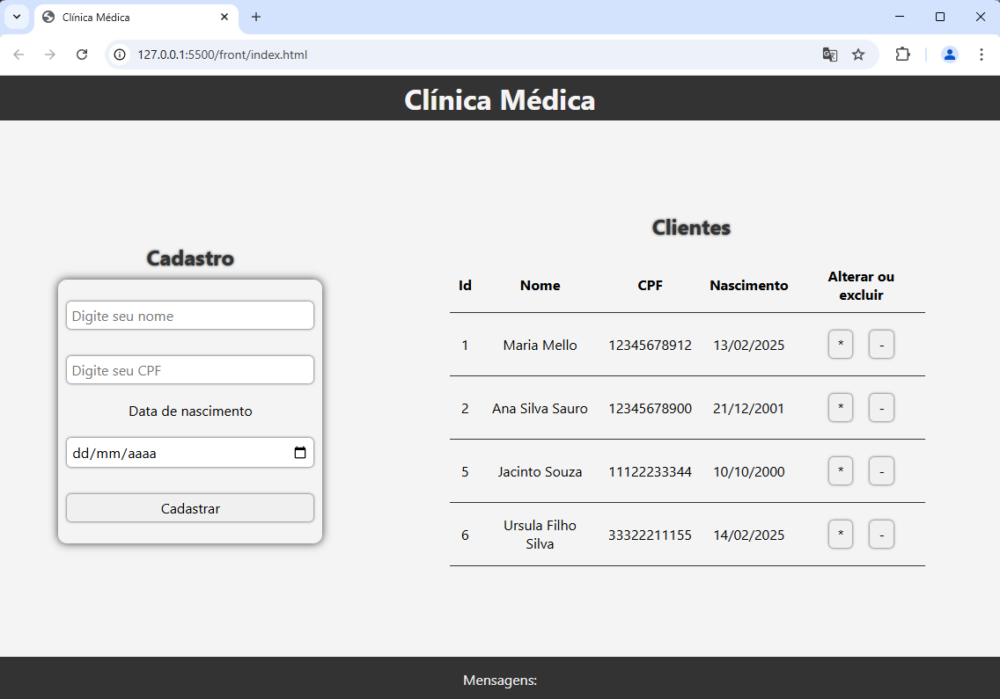
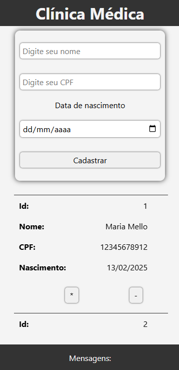

# Projeto Clínica Médica
Exemplo de CRUD simples **full-stack** com uma tabela de clientes.
|Wireraframe Web|Wireframe Mobile|
|-|-|
|||

## Tecnologias
- **Frontend**: HTML, CSS e JavaScript
- **Backend**: NodeJS com Express
- **Banco de Dados**: MySQL

## Requisitos
- Git
- NodeJS
- MySQL
- VsCode

## Como rodar
- 1 Clonar o repositório
- 2 Abrir o projeto no VsCode
- 3 Instalar o Banco de dados no Mysql (Via XAMPP dar start em MySQL).
```sql
CREATE DATABASE clinica;
USE clinica;

CREATE TABLE clientes(
    id_cliente INTEGER PRIMARY KEY AUTO_INCREMENT,
    nome VARCHAR(255) NOT NULL,
    cpf VARCHAR(255) NOT NULL,
    nascimento VARCHAR(255) NOT NULL
);

ALTER TABLE clientes CHANGE COLUMN nascimento nascimento DATE;
DESCRIBE clientes;
```
- 4 Abrir o terminal **cmd** ou **bash**, navegar até a pasta **./api** e rodar:
```bash
cd api
npm install
npm start
# ou
npx nodemon
```
- 5 Navegar até a pasta **./web** e executar o arquivo **index.html** no navegador ou via live server do VsCode
